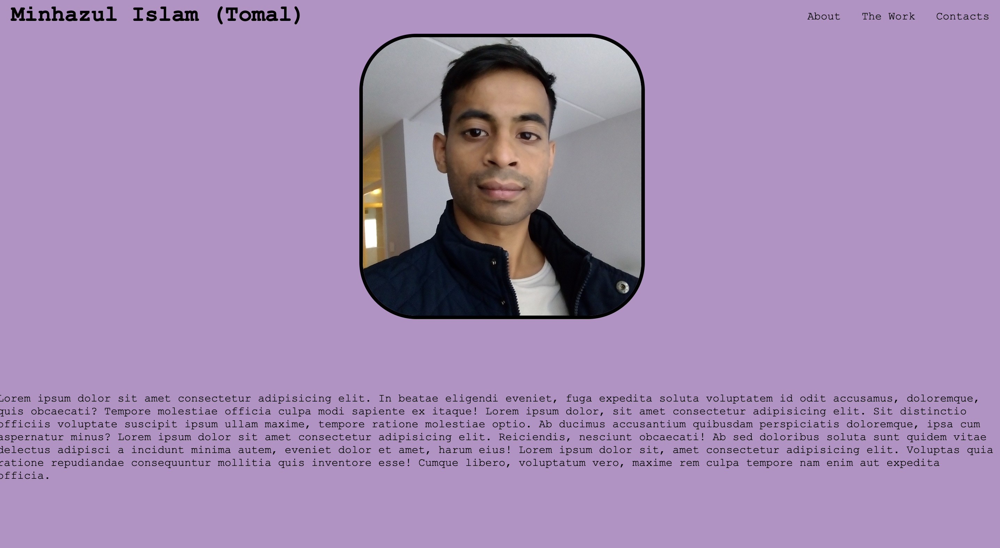
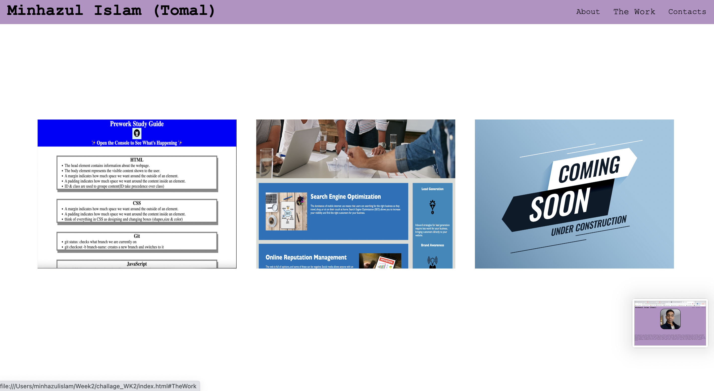
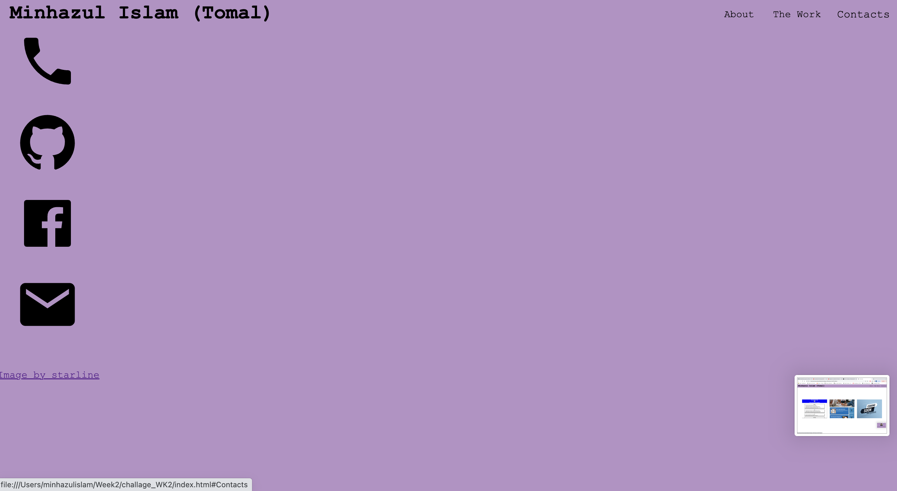
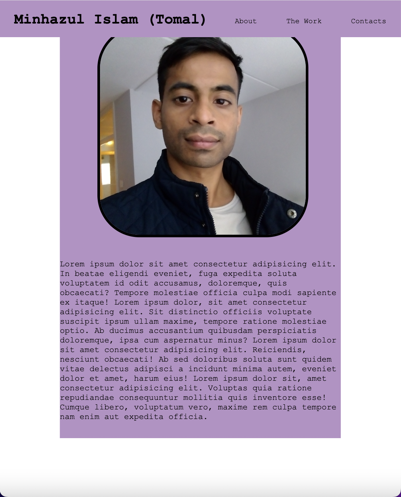
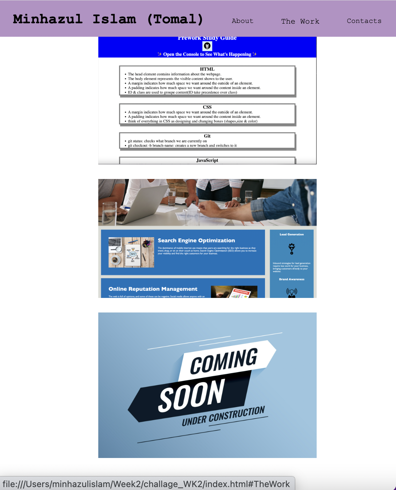
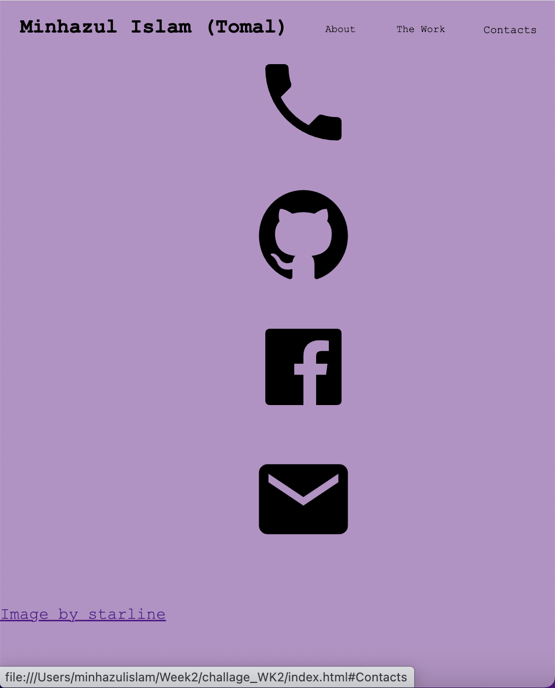

# week 2 assignment

## Description

This was the second assignment for the coding bootcamp, the task was to create a website which functions on various screen sizes.
The contents showcasing the developes previous deployed websites as well as demonstrating various functonality traites as requested on the assignment specification.

There were many challenges such as positoning the contents at various screen sizes and still being funcatinal, however it was a great learning experince. 

git hub reposotry: https://github.com/Tomal1/challage_WK2
deployed website: https://tomal1.github.io/challage_WK2/

## Usage

simple web page: when you click on the nav links the UI will scroll to the relevent sections.

In "The work" section the developers previous work will be showcased and if thumbnail are selected (with the exception of the third one); the user should be taken to the deployed websites on a new tab.

When the screen size is altered, the contents will adjust accordingly and on the last section "Contacts"; links to the devlopers contacts which have not been given real links are displayed.

below are some screen shots for your reference:

## Credits

the coming soon under construction illustration design has been taken externally and has been attrubuted in the deployed website, for further information please visit the following website:

https://www.freepik.com/free-vector/coming-soon-construction-illustration-design_13732339.htm#query=coming%20soon&position=3&from_view=keyword

## License

Please refer to the LICENSE in the repo.
